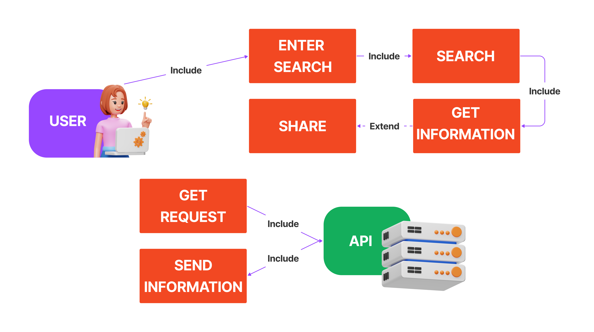

# Finder 
Welcome to **Finder**, the application that helps you discover relevant information based on your year of birth. With Finder, you can explore interesting facts about important events, historical milestones, and culturally significant moments from the time you were born.

To get started, simply enter your year of birth on the main screen and click "Search". Within seconds, Finder will gather relevant data from a variety of reliable sources and present you with a personalized list of results.

For example, if you were born in 1990, Finder will provide information about some of the most important events from that year, such as the release of Nelson Mandela, the fall of the Berlin Wall, and the beginning of the Gulf War.

Finder is an incredibly useful app for those who want to discover meaningful information about their birth year. No matter what year you were born, Finder has something for everyone.

---

## Use Case
  
The provided JavaScript code allows users to search for information using the public Wikipedia API and display results on a web page. Therefore, the main use case is "Search for information via the Wikipedia API", which breaks down into the following sub-use cases:
- Enter search term  
- Perform search  
- Display results  
- Select result for detailed view  

---

## Logical Diagram
  
The JavaScript code consists of two main components: the user interface and the search logic. The user interface is responsive and allows the user to enter a search term and initiate the search. The search logic handles connecting to the public Wikipedia API, sending the search query, and processing the results to display them in the user interface.

---

## Physical Diagram
  
The user interface runs in the user's web browser, while the search logic is executed on Wikipedia's servers through an internet connection. Wikipedia’s server processes the search request and sends the results back to the user's browser.
